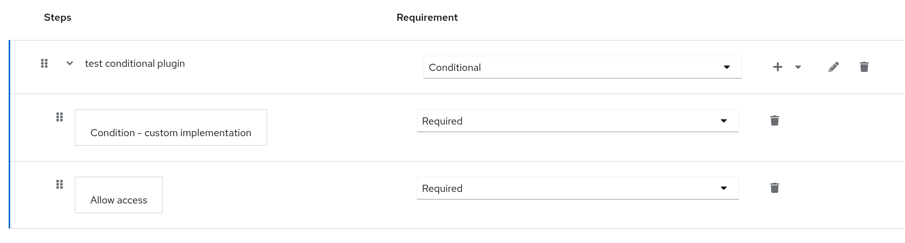

# custom-conditional-authenticator

Keycloakの `ConditionalAuthenticator` を実装したプラグイン (SPI)。
`matchCondition()` メソッド内でリクエストの検証や外部サイトの呼び出しなどの典型的な処理の例を実装している。

# 使い方

外部のIdentity Providerを設定済みで、その "Post Login Flow" に指定して使用する例を示す。

プラグインをビルド・デプロイする。

```
mvn clean package
cp target/custom-conditional-authenticator.jar $KC_HOME/providers/

# 開発モードでログレベルを変更して起動
$KC_HOME/bin/kc.sh start-dev --log-level=com.example:all
```

起動後、masterレルムの "Provider info" で本プラグインのIDである "custom-conditional-authenticator" が存在するか確認する。

下記のような認証フローを作成する。
ここで "Condition - Custom Implementation" のみがこのプロジェクトで作成したプラグインになる。



設定しているIdPの "Post Login Flow" に上記の認証フローを設定する。

試しにこのIdPを使ってログインしてみて、 `matchCondition()` メソッドの実行結果をログで確認する。

# OpenShift上でのKeycloak Operatorでカスタムイメージを使う方法

管理者権限で専用の名前空間にKeycloak Operatorをインストール済みとする。

## 一旦Keycloakをデフォルトのイメージのままデプロイする

まず以下のコマンドでDBを作成する。

```
oc new-app --template=postgresql-persistent \
   -p POSTGRESQL_VERSION=13-el8 \
   -p DATABASE_SERVICE_NAME=kcpostgres \
   -p POSTGRESQL_USER=kcusername \
   -p POSTGRESQL_PASSWORD=kcpassword \
   -p POSTGRESQL_DATABASE=kcdatabase
```

その後に作成したDBを参照するようにKeycloak CRを作成する。
以下はHTTPSをRouterで終端する`proxy=edge`の例である。

```
apiVersion: k8s.keycloak.org/v2alpha1
kind: Keycloak
metadata:
  name: keycloak
spec:
  instances: 1
  db:
    vendor: postgres
    host: kcpostgres
    usernameSecret:
      key: database-user
      name: kcpostgres
    passwordSecret:
      key: database-password
      name: kcpostgres
    database: kcdatabase
  hostname:
    hostname: keycloak-$(oc project -q).${CLUSTER_NAME}
  additionalOptions:
    - name: proxy
      value: edge
```

これを `oc apply` で適用するが、`spec.hostname.hostname` はプロジェクト名やOpenShiftクラスタ名にあわせること。

## カスタムイメージのビルド

```
# まずプラグインそのものをビルドしてイメージビルド用のディレクトリにコピーしておく
mvn clena package
cp target/custom-conditional-authenticator.jar dockerbuild/

cd dockerbuild

# BuildConfigの作成
oc new-build --name=myrhbk --strategy=docker --binary=true

# OpenShift上でビルドの開始
oc start-build myrhbk --from-dir=. --follow --wait

# 作成されたイメージ名の確認
oc get is
```

## Keyclaok CRをカスタムイメージを使うように編集

管理コンソールや `oc edit keycloak ...` コマンドなどでマニフェストを編集する。

```
  spec:
    image: default-route-openshift-image-registry.apps-crc.testing/rhbk/myrhbk:latest
```

上記の用に、`spec.image`にカスタムイメージを指定する。
ここでは先に`oc get is`で調べた名前を指定する。

Keycloak CRのその他の設定は一部無視されるので注意する。
具体的には、ビルド時のオプションに相当するもの（特にDBの設定）は無視されるので、
それらは代わりにkeycloak.confにあらかじめ書いてイメージビルド時に入れ込んでおく。

# 参考

- ユーザーの属性をチェックする `ConditionalAuthenticator` のデフォルト実装
  - [ConditionalUserAttributeValueFactory](https://github.com/keycloak/keycloak/blob/22.0.5/services/src/main/java/org/keycloak/authentication/authenticators/conditional/ConditionalUserAttributeValueFactory.java)
  - [ConditionalUserAttributeValue](https://github.com/keycloak/keycloak/blob/22.0.5/services/src/main/java/org/keycloak/authentication/authenticators/conditional/ConditionalUserAttributeValue.java)
- [コミュニティ版のカスタムイメージ作成ガイド](https://www.keycloak.org/server/containers)
- [RHBKのOperatorでカスタムイメージを使うための公式ドキュメント](https://access.redhat.com/documentation/en-us/red_hat_build_of_keycloak/22.0/html-single/operator_guide/index#customizing-keycloak-)

